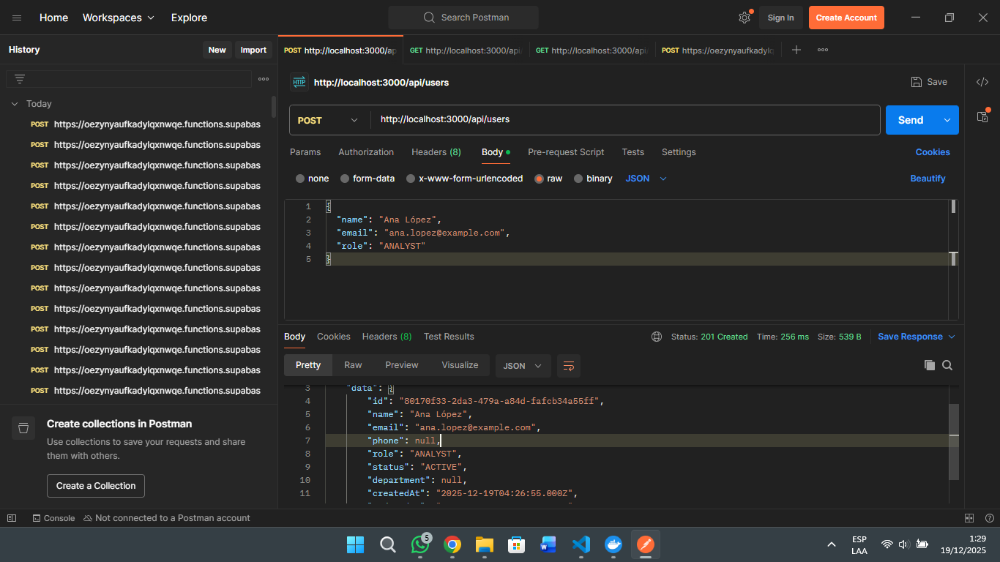

# Evidencias de pruebas (Postman)

Este documento reúne las capturas de las pruebas realizadas con Postman para los endpoints del proyecto.

> Coloca las imágenes en `docs/images/` con los nombres indicados para que se vean aquí automáticamente.

---

## 1. Crear usuario (POST)

- Endpoint: `http://localhost:3000/api/users`
- Cuerpo de ejemplo:

```json
{
  "name": "Ana López",
  "email": "ana.lopez@example.com",
```

Resultado esperado: `201 Created` con el objeto del usuario creado.



---

## 2. Listar usuarios (GET)

  
- Resultado esperado: `200 OK` con arreglo de usuarios.


---
  
- Endpoint: `http://localhost:3000/api/users/{id}`


  

- Cuerpo de ejemplo:

- Endpoint: `http://localhost:3000/api/reports`
```json
  "assignedToId": "fc50e2c6-f1fa-44db-8daa-5315960edf5f",
  "title": "Alerta SQL Injection",
  "description": "Se detectó posible inyección en /login",
  "priority": "HIGH"
}
```

Resultado esperado: `201 Created` con el reporte creado.


---
  
## 5. Listar reportes (GET)
- Endpoint: `http://localhost:3000/api/reports`
- Resultado esperado: `200 OK` con arreglo de reportes.

  

---

## 6. Listar reportes activos (GET)
  


---

## 7. Obtener reporte por id (GET)

- Endpoint: `http://localhost:3000/api/reports/{id}`
- Resultado esperado: `200 OK` con el objeto del reporte.

- Endpoint: `http://localhost:3000/api/reports/{id}`
- Resultado esperado: `200 OK` con el objeto del reporte.


---

## 8. Actualizar reporte (PATCH)

- Endpoint: `http://localhost:3000/api/reports/{id}`
- Cuerpo de ejemplo:

```json
{
  "title": "Alerta SQLi actualizada",
  "priority": "URGENT",
  "status": "IN_PROGRESS"
}
```

Resultado esperado: `200 OK` con el objeto actualizado.


---

## 9. Completar reporte (PATCH findings)

- Endpoint: `http://localhost:3000/api/reports/{id}/complete`
- Cuerpo de ejemplo:

```json
{
  "findings": "No se reprodujo el vector. Se aplicó validación parametrizada."
}
```

Resultado esperado: `200 OK` con el reporte en `COMPLETED`.


---

## 10. Eliminar reporte (DELETE)

- Endpoint: `http://localhost:3000/api/reports/{id}`
- Resultado esperado: `200 OK` con `success: true`.


---

## Notas

- Si alguna captura no se visualiza, verifica que el archivo exista en `docs/images/` con el nombre correcto.
- Nombres sugeridos:
  - `postman-create-user.png`
  - `postman-list-users.png`
  - `postman-get-user.png`
  - `postman-report-create-exito.png`
  - `postman-report-list-exito.png`
  - `postman-report-get-exito.png`
